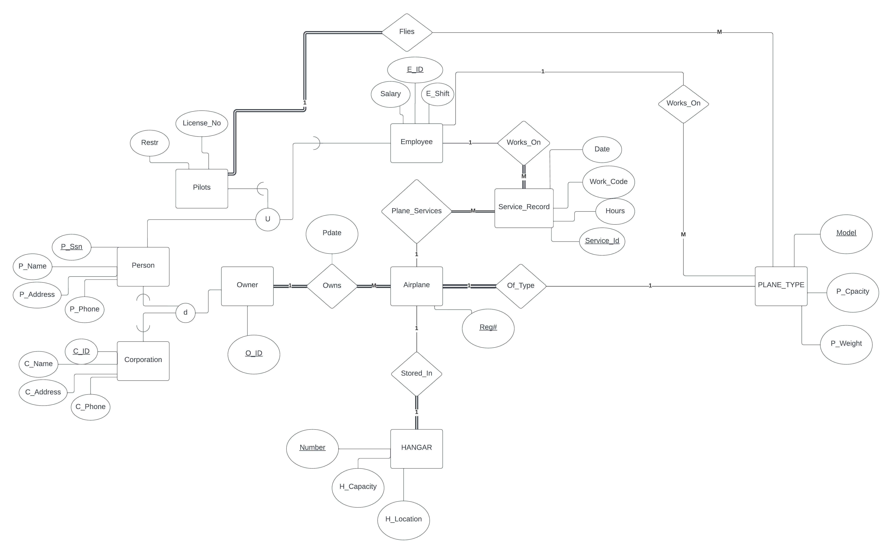

# __Small Private Airport Database (Assignment 2)__

# **Introduction**
Initially we were presented with a case study on an airplane database system. It was quite similar to an already performed task in the lab and thus we had some prior experience. Using the information we acquired from our classes and our own general knowledge we constructed a schema. This is a database that keeps track of airplanes, their owners, airport employees, and pilots. 

`Software Used For Creating Schema:` **Lucidchart**

# ERD Diagram

## Brief Explanation

This is a database that keeps track of airplanes, their owners, airport employees, and pilots. The database has been designed based on the following entities and relationships:

- Each AIRPLANE has a registration number, is of a particular plane type, and is stored in a particular hangar.

- Each PLANE_TYPE has a model number, a capacity, and a weight.

- Each HANGAR has a number, a capacity, and a location.

- The database also keeps track of the OWNERs of each plane and the EMPLOYEEs who have maintained the plane.

- Each relationship instance in OWNS relates an AIRPLANE to an OWNER and includes the purchase date.

- Each relationship instance in MAINTAIN relates an EMPLOYEE to a service record.

- Each plane undergoes service many times; hence, it is related by PLANE_SERVICE to a number of SERVICE records.

- A SERVICE record includes as attributes the date of maintenance, the number of hours spent on the work, and the type of work done.

- An OWNER is either a person or a corporation.

- Both pilots and employees are subclasses of PERSON.

- Each PILOT has specific attributes license number and restrictions.

- Each EMPLOYEE has specific attributes salary and shift worked.

- All PERSON entities in the database have data kept on their Social Security number, name, address, and telephone number.

- For CORPORATION entities, the data kept includes name, address, and telephone number.

- The database also keeps track of the types of planes each pilot is authorized to fly and the types of planes each employee can do maintenance work on.

# Tables Created and Relational Model

The following tables have been created to represent the entities and relationships in the database:

`Software used for database creation:` **SQL Server**

- PERSON :  entity with attributes for personal information

- CORPORATION: entity with attributes for corporate information

- OWNER : OWNER relates an AIRPLANE to a PERSON or CORPORATION, and includes the purchase date [Pdate].

- PLANE_TYPE: represents different models of airplanes and their corresponding attributes, such as capacity and weight.

- HANGAR: represents storage locations for airplanes, with attributes for capacity and location.

- AIRPLANE:  is related to PLANE_TYPE and HANGAR.

- EMPLOYEE: subclasses of PERSON, with additional attributes for salary, shift, license number, and restrictions.

- PILOT: subclasses of PERSON, with additional attributes for salary, shift, license number, and restrictions.

- SERVICE_RECORD: includes attributes for the date of maintenance, number of hours spent on the work, and type of work done.
 
- PLANE_SERVICE: relates an AIRPLANE to multiple SERVICE_RECORD instances.

- OWNS:  relates an AIRPLANE to an OWNER.

- WORKS_ON: relates an EMPLOYEE to a PLANE_TYPE that they are authorized to do maintenance work on.
- FLIES: relates a PILOT to a PLANE_TYPE that they are authorized to fly.

# Challenges We Faced

One of the major challenges we faced during the development process was the lack of dummy data provided to us. We were initially given only the data schema and had to construct our own data to test our application. This proved to be quite difficult as we had to ensure that the data we generated was valid and realistic, which was time-consuming and prone to errors.

Without any pre-existing data to work with, we had to manually create all of the data that our application would use for testing and development. This involved a significant amount of effort, as we had to create data that not only adhered to the data schema, but also included a wide range of scenarios and edge cases, in particular the queries we were given later on in the assignment. We had to rely on synthetic data, which may not have accurately reflected the behavior of real users and their interactions with the system. 

In order to overcome this issue we had to spend quite a significant amount of time and man-power in effort to verify our data and to cross check the consistency, in particular @AhmadHassan71 who went to painstaking lengths to cross-check the integrity of our data even heading to websites online to generate data to avoid any sort of possible human errors in generation

# Results

Here were the results to the queries which we ran (some of which didn't return any result due to our dummy data):

## Query 3

! [query 3](screenshots/q3.JPG)
## Query 4
! [query 4](screenshots/q4.JPG)

## Query 5

! [query 5](screenshots/q5.JPG)

## Query 6

! [query 6](screenshots/q6.JPG)

## Query 7

! [query 7](screenshots/q7.JPG)

## Query 8

! [query 8](screenshots/q8.JPG)

## Query 9

! [query 9](screenshots/q9.JPG)

## Query 10

! [query 10](screenshots/q10.JPG)

## Query 11
! [query 11](screenshots/q11.JPG)

## Query 12

! [query 12](screenshots/q12.JPG)

## Query 13

! [query 13](screenshots/q13.JPG)

## Query 14

! [query 14](screenshots/q14.JPG)

## Query 15

! [query 15](screenshots/q15.JPG)

## Query 16

! [query 16](screenshots/q16.JPG)

## Query 17

! [query 17](screenshots/q17.JPG)

## Query 18

! [query 18](screenshots/q18.JPG)

## Query 19

! [query 19](screenshots/q19.JPG)

## Query 20
! [query 20](screenshots/q20.JPG)

## Query 21

! [query 21](screenshots/q21.JPG)

## Query 22
! [query 22](screenshots/q22.JPG)

## Query 23
! [query 23](screenshots/q23.JPG)

## Query 24

! [query 24](screenshots/q24.JPG)

## Query 25

! [query 25 - 1](screenshots/q25a.JPG)

! [query 25 - 2](screenshots/q25c.png)

! [query 25 - 3](screenshots/q25d.JPG)

! [query 25 - 4](screenshots/q25e.JPG)

# Credits
This database was designed and implemented by @AhmadHassan71 (21I-0403) and @FarazRashid (21I- 0659). If you have any questions or feedback, please feel free to contact us at our emails.
